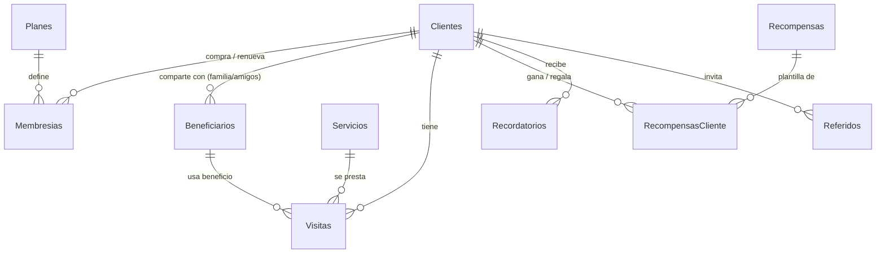

# 1. Modelo de datos en Google Sheets

Cada **hoja (pestaña)** del libro de Google Sheets es una tabla. La fila 1 son los encabezados y cada fila siguiente es un registro. La función `instalar()` crea todo esto sola; esta guía explica qué guarda cada hoja.

> Las columnas de texto (teléfonos, códigos, fechas) se guardan como **texto plano** para que Sheets no las “corrija”. Las fechas van en formato `aaaa-mm-dd` (ej: `2026-09-25`).

## Diagrama de relaciones

## Hojas de configuración (las edita el dueño)

### `Config`
| clave | valor por defecto | para qué sirve |
|---|---|---|
| NOMBRE_NEGOCIO | Mi Barbería | Aparece en todos los mensajes |
| PIN_DUENO | 1234 | Clave para entrar a la app. **Cámbiala** |
| WHATSAPP_NEGOCIO | | Para que los clientes aparten turno desde “Mi membresía” |
| EMAIL_DUENO | | Si lo llenas, recibes cada mañana la lista de clientes a contactar |
| PROFESIONALES | Carlos, Yuli | Quién atiende (botones en la visita) |
| META_MIEMBROS | 40 | Meta mensual de miembros activos |
| DURACION_MEMBRESIA_DIAS | 30 | Duración de cada pago |
| DIAS_RECORDAR / DIAS_RIESGO / DIAS_PERDIDO | 21 / 35 / 60 | Umbrales de inactividad |
| DIAS_AVISO_VENCIMIENTO | 3 | Aviso antes de vencer la membresía |
| PUNTOS_POR_VISITA / PUNTOS_POR_MIL | 10 / 1 | Fórmula de puntos |
| PUNTOS_REFERIDO | 50 | Bono al miembro cuando un amigo suyo se registra |

### `Planes` — tipos de membresía
| columna | ejemplo | nota |
|---|---|---|
| plan_id | PL-FAMILIAR | identificador |
| nombre | Membresía Familiar | |
| precio_mensual | 60000 | pesos |
| cupos_beneficiarios | 3 | cuántos familiares/amigos pueden compartirla |
| usos_mes_beneficiario | 3 | visitas con descuento por beneficiario al mes (0 = sin límite) |
| descuento_titular_pct | 20 | % para el titular |
| descuento_beneficiario_pct | 15 | % para cada beneficiario |
| beneficios | texto | lo que se le muestra al cliente |
| activo | si / no | |

Planes iniciales: **Personal** ($35.000, 1 cupo), **Familiar** ($60.000, 3 cupos), **VIP** ($90.000, 4 cupos sin límite).

### `Servicios`
`servicio_id, nombre, categoria, precio, duracion_min, activo` — el catálogo con precios de lista.

### `Recompensas` — catálogo de premios (reglas de la fidelización)
| columna | significado |
|---|---|
| tipo | `bienvenida`, `visitas` (cada N visitas), `nivel` (al subir a un nivel), `cumpleanos`, `regreso` (cliente en riesgo que vuelve), `referido`, `renovacion` (cada N renovaciones), `puntos` (canje) |
| umbral | N visitas / N renovaciones / puntos que cuesta |
| nivel | para `tipo = nivel`: plata, oro, diamante |
| descuento_pct | % que descuenta al usarlo (100 = gratis) |
| transferible | `si` = se puede **regalar** a familiares o amigos |
| vigencia_dias | días para usarlo |

## Hojas de operación (las llena la app)

### `Clientes`
`cliente_id, nombre, telefono, fecha_nacimiento, genero, barrio, servicio_favorito, fecha_registro, referido_por, puntos, nivel, total_visitas, total_gastado, ultima_visita, segmento, acepta_whatsapp, notas`

- `segmento`: `al_dia`, `recordar`, `riesgo`, `perdido`, `nuevo` (se recalcula cada día).
- `nivel`: `bronce` (0+ visitas), `plata` (6+, puntos ×1,25), `oro` (15+, ×1,5), `diamante` (30+, ×2).
- `referido_por`: `cliente_id` de quien lo recomendó.

### `Membresias`
`membresia_id, cliente_id, plan_id, codigo, fecha_inicio, fecha_vencimiento, fecha_pago, valor_pagado, metodo_pago, estado, renovaciones`

- Cada pago o renovación es una **fila nueva** (así se ven los ingresos por mes).
- `codigo`: 4 números, se conserva al renovar; con él el cliente consulta su membresía.
- `estado`: `activa`, `renovada` (reemplazada por la siguiente), `vencida`.

### `Beneficiarios` — beneficios compartidos
`beneficiario_id, titular_id, nombre, telefono, parentesco, fecha_alta, ultima_visita, estado`

Los beneficiarios usan la membresía del **titular**: reciben su descuento y **los puntos de sus visitas van al titular** (membresía colectiva).

### `Visitas` — historial de consumo
`visita_id, fecha, hora, cliente_id, beneficiario_id, atendido_nombre, servicio_id, servicio_nombre, profesional, valor_lista, descuento_pct, descuento, valor_pagado, metodo_pago, puntos_ganados, recompensa_usada, notas`

### `RecompensasCliente` — premios ganados
`rc_id, cliente_id, recompensa_id, nombre, codigo, descuento_pct, fecha_otorgada, fecha_vence, origen, estado, transferida_a_nombre, transferida_a_tel, canjeada_por, fecha_canje`

- `estado`: `disponible` → `canjeada` | `transferida` (regalada) → `canjeada` | `vencida`.

### `Recordatorios`
`recordatorio_id, fecha, cliente_id, nombre, telefono, tipo, clave, dias_sin_visita, mensaje, link_whatsapp, estado, fecha_envio`

- `tipo`: `recordar`, `riesgo`, `perdido`, `vence`, `vencida`, `cumpleanos`.
- `clave`: evita duplicados (ej: `CL-123|riesgo|2026-08-01` = un solo aviso de riesgo por cada última visita).
- `estado`: `pendiente`, `enviado`, `descartado`, `resuelto` (el cliente volvió).
- `link_whatsapp`: enlace `wa.me` con el mensaje ya escrito; el dueño solo toca **Enviar**.

### `Referidos`
`referido_id, fecha, titular_id, nombre, telefono, origen, estado, cliente_id, bono_otorgado`

- `origen`: `invitacion`, `regalo` (le regalaron un premio), `registro`.
- `estado`: `invitado` → `convertido` cuando se registra como cliente (y el titular recibe su bono).
