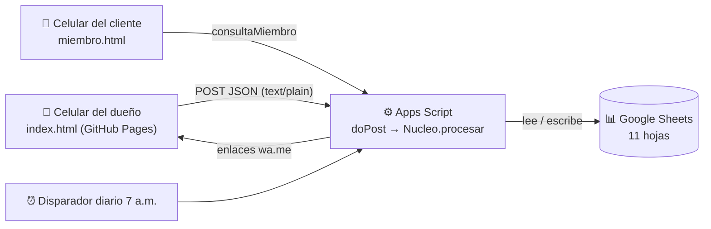

# 3. Integración: GitHub Pages ⇄ Apps Script ⇄ Google Sheets



## 1. Publicar el frontend en GitHub Pages (gratis)

1. Sube este repositorio a GitHub (puede ser cualquier cuenta u organización).
2. En el repositorio: **Settings → Pages → Build and deployment**
   - *Source*: **Deploy from a branch**
   - *Branch*: la rama con el código (ej: `main`) y carpeta **`/ (root)`** → **Save**.
3. En 1–2 minutos queda en `https://<usuario>.github.io/<repositorio>/`.
   - App del dueño: `…/index.html`
   - Página para clientes: `…/miembro.html`

Sin configurar nada más, la app abre en **modo demostración** (datos de ejemplo guardados en el propio celular, PIN `1234`).

## 2. Conectar con tu Google Sheets

Tienes dos opciones:

**A. Desde la app (cada celular):** ⚙️ **Ajustes → Mi Google Sheets → pega la URL `/exec` → Probar → Guardar**, y entra con tu PIN.

**B. Para todos a la vez:** edita `assets/js/config.js`:
```js
window.CLUB_CONFIG = { API_URL: 'https://script.google.com/macros/s/AKfy.../exec' };
```
Haz commit; GitHub Pages se actualiza solo. La página de clientes `miembro.html` también usa esta URL, así que **esta opción es la necesaria para compartirla con los clientes**.

## 3. Cómo funciona la llamada (y por qué `text/plain`)

Apps Script no responde a las peticiones previas `OPTIONS` de CORS. Si el navegador enviara `Content-Type: application/json`, haría esa petición previa y fallaría. Enviando `text/plain` es una “petición simple”: no hay petición previa, Apps Script redirige a `script.googleusercontent.com` con la respuesta y `fetch` sigue la redirección.

```js
const r = await fetch(API_URL, {
  method: 'POST',
  headers: { 'Content-Type': 'text/plain;charset=utf-8' },
  body: JSON.stringify({ accion: 'dashboard', pin: '1234', datos: {} }),
  redirect: 'follow'
});
const { ok, datos, error } = await r.json();
```

En el servidor:
```js
function doPost(e) {
  const cuerpo = JSON.parse(e.postData.contents);
  return ContentService.createTextOutput(JSON.stringify(
    Nucleo.procesar(crearAdaptadorSheets(), cuerpo.accion, cuerpo.datos, cuerpo.pin)
  )).setMimeType(ContentService.MimeType.JSON);
}
```

## 4. Un solo núcleo, dos “bases de datos”

`backend/Nucleo.js` recibe un objeto `db` con 5 funciones (`all`, `insert`, `update`, `hoy`, `hora`):

| Entorno | Adaptador | Dónde guarda |
|---|---|---|
| Apps Script | `crearAdaptadorSheets()` en `BaseDatos.gs` | Google Sheets |
| Navegador (demo) | `assets/js/demo.js` | `localStorage` |
| Pruebas | `pruebas/nucleo.test.js` | memoria |

Por eso, si cambias una regla (ej: puntos), la cambias **una sola vez** en `Nucleo.js`, la copias al proyecto de Apps Script y vuelves a implementar.

## 5. Problemas comunes

| Síntoma | Solución |
|---|---|
| “El servidor no respondió bien” | La implementación no tiene acceso **Cualquier usuario**, o pegaste la URL `/dev` en vez de `/exec`. |
| Cambié el código y no se ve | Crea una **Versión nueva** de la implementación. |
| “PIN incorrecto” | Revisa `PIN_DUENO` en la hoja Config (sin espacios). |
| “Falta la hoja …” | Ejecuta `instalar()` otra vez (no borra datos). |
| “Demasiados intentos fallidos” | Espera 10 minutos. |
| No llegan recordatorios | En Apps Script → ⏰ **Activadores** debe existir `tareaDiaria`. Si no, ejecuta `instalarDisparadores()`. |
| Lento la primera vez | Apps Script “despierta” en 2–4 s tras un rato sin uso; luego va más rápido. |

## 6. Límites del plan gratuito (suficientes para un negocio de barrio)
- Apps Script: ~20.000 llamadas/día, 6 min por ejecución, 100 correos/día.
- Google Sheets: 10 millones de celdas (≈ 500.000 visitas).
- GitHub Pages: 100 GB de tráfico/mes.
- WhatsApp: se usan enlaces `wa.me` (gratis), el dueño toca **Enviar** desde su propio WhatsApp. Para envío 100% automático habría que usar la API de WhatsApp Business (de pago), fuera del alcance de este MVP.
